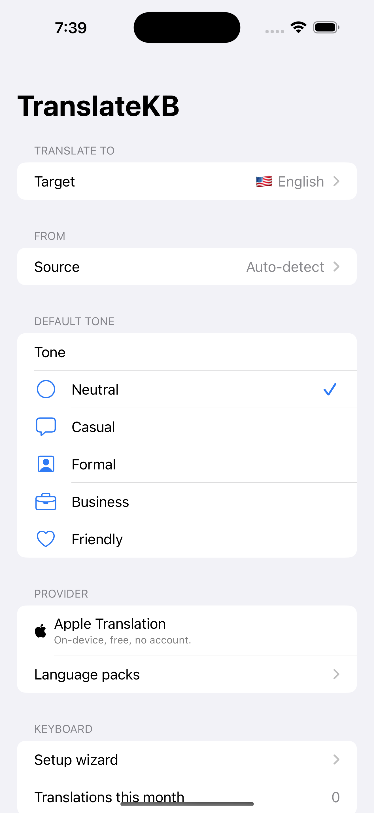
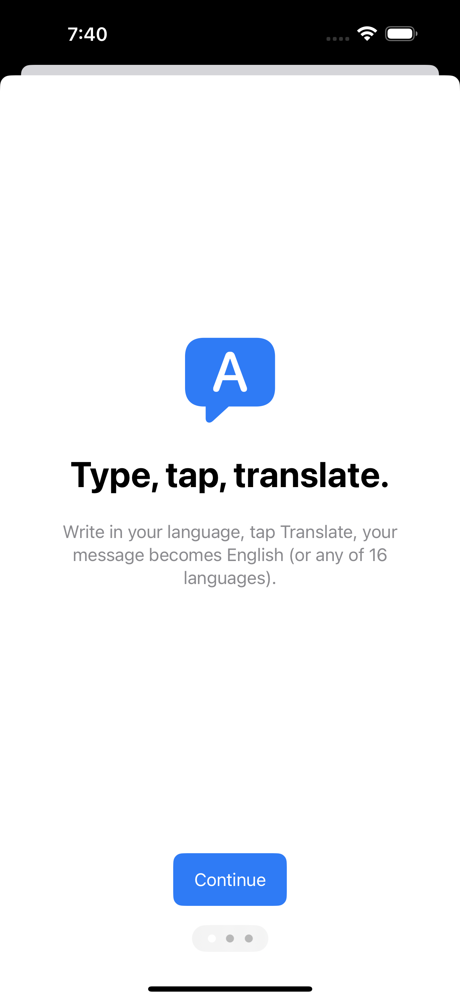

# Yet Another Translate Keyboard

[](LICENSE)
[](https://swift.org)
[](https://developer.apple.com/ios/)

A custom iOS keyboard that translates the user's draft with one tap. Type in
your language, tap **Translate**, your message is replaced in-place inside
WhatsApp, Telegram, Mail, or any app with a text field.

Backed by Apple's on-device Translation framework (iOS 18+). Architected so a
second translation provider (DeepL, OpenAI, Anthropic) or a tone adapter
(cloud LLM) can be swapped in with no changes to the keyboard UI.

<p align="center">
  
  
</p>

## Requirements

- Xcode 26+
- iOS 17.4+ deployment target (iOS 18+ required at runtime for the
  programmatic Translation API the keyboard relies on; 17.4–17.x users see a
  "needs iOS 18" message)
- Tuist 4.83+
- Paid Apple Developer team (custom keyboards need App Groups + a real
  provisioning profile to translate on device)

## Setup

```bash
# Generate the Xcode workspace
tuist install
tuist generate
# or, open immediately
tuist generate --open
```

### Replace before shipping

These constants are hard-coded for the original developer — change them in
`Project.swift` and the two `.entitlements` files before submitting your own
build:

- `bundlePrefix`           → your reverse-DNS prefix
- `teamId` (`5P8935L6RT`)  → your Apple Developer team ID
- `appGroupId`             → `group.<your-prefix>`

Also update the App Group identifier inside
`Shared/Sources/Storage/AppGroupStorage.swift:7`.

### Build & run

```bash
xcodebuild \
  -workspace TranslationKeyboard.xcworkspace \
  -scheme TranslationKeyboard \
  -destination 'platform=iOS Simulator,name=iPhone 16 Pro,OS=18.2' \
  -configuration Debug \
  build CODE_SIGNING_ALLOWED=NO
```

For on-device testing, drop the `CODE_SIGNING_ALLOWED=NO` flag and let Xcode
manage the signing — the App Group entitlement needs a real provisioning
profile.

### Run the unit tests

```bash
xcodebuild \
  -workspace TranslationKeyboard.xcworkspace \
  -scheme TranslationKeyboard \
  -destination 'platform=iOS Simulator,name=iPhone 16 Pro,OS=18.2' \
  test CODE_SIGNING_ALLOWED=NO
```

18 tests covering `TranslationPipeline`, `MockTranslationProvider`,
`UsageCounter`, `AppGroupStorage`, and `VoiceProvider`.

## Enabling the keyboard on device

1. Build & install the app on your iPhone (iOS 17.4+, ideally iOS 18+).
2. Open the **Yet Another Translate Keyboard** app once so the keyboard extension is registered.
3. iOS Settings → General → Keyboard → Keyboards → **Add New Keyboard…** →
   Yet Another Translate Keyboard.
4. Tap Yet Another Translate Keyboard in the list → enable **Allow Full Access**. (Required so
   the keyboard can reach the Translation framework, which downloads
   language packs over the network.)
5. In any app with a text field, long-press 🌐 to switch to Yet Another Translate Keyboard.

## Architecture in one paragraph

Two protocols — `TranslationProvider` and `ToneAdapter` — are composed by a
`TranslationPipeline`. The keyboard and the dev tools talk only to the
pipeline; swapping a provider or adapter is a one-file change. The current
shipping configuration is `AppleTranslationProvider` + `NoOpToneAdapter`.
Stubs for cloud providers/adapters are in place so v2 can plug them in
without touching the UI. See [ARCHITECTURE.md](ARCHITECTURE.md) for details.

## Adding a new translation provider

```swift
public final class DeepLProvider: TranslationProvider {
    public let identifier  = "deepl"
    public let displayName = "DeepL"

    public func isAvailable() async -> Bool { /* check API key, network */ }
    public func supportedSourceLanguages() async -> [Language] { /* ... */ }
    public func supportedTargetLanguages() async -> [Language] { /* ... */ }

    public func translate(_ text: String, from: Language?, to: Language)
    async throws -> TranslationResult { /* HTTP call */ }
}
```

Wire it into `KeyboardCoordinator.swift:21` by changing the `pipeline` lazy:

```swift
private lazy var pipeline: TranslationPipeline = {
    let provider = DeepLProvider(apiKey: KeychainStorage().get("deepl_key")!)
    return TranslationPipeline(provider: provider, toneAdapter: NoOpToneAdapter())
}()
```

Zero changes to keyboard views, settings, onboarding, or tests. Existing
`TranslationPipelineTests` continue to pass.

## Adding a new tone adapter

```swift
public struct ClaudeToneAdapter: ToneAdapter {
    public let identifier  = "claude_tone"
    public let displayName = "Claude tone"

    public func isAvailable() async -> Bool { true }
    public func supportedTones() -> [Tone] { Tone.allCases }

    public func adapt(_ text: String, tone: Tone, language: Language)
    async throws -> String { /* Anthropic API call using tone.prompt */ }
}
```

Same one-line swap in `KeyboardCoordinator.swift`:

```swift
let adapter = ClaudeToneAdapter(apiKey: /* ... */)
```

## Project layout

```
TranslationKeyboard/
├── Tuist.swift, Project.swift   # Tuist project definition
├── App/                          # Main container app target
├── Keyboard/                     # Keyboard extension target
├── Shared/                       # Shared framework (protocols, models, pipeline)
└── Tests/                        # XCTest targets
```

Each target's `Entitlements/` folder holds the App Group entitlement.

## Memory budget

Apple gives keyboard extensions ~50MB. The keyboard intentionally does **not**
import `FoundationModels` — that framework needs ~1.2GB and would OOM-crash
the extension. AI tone adaptation happens in v2 via cloud LLM (lightweight),
not on-device models.

## Out of scope for v1

Voice input, image translation, translation history, accounts, subscriptions,
themes, iPad-specific layout, widgets, in-keyboard language switching, and
non-Latin typing layouts. See the spec in the project docs for details.
